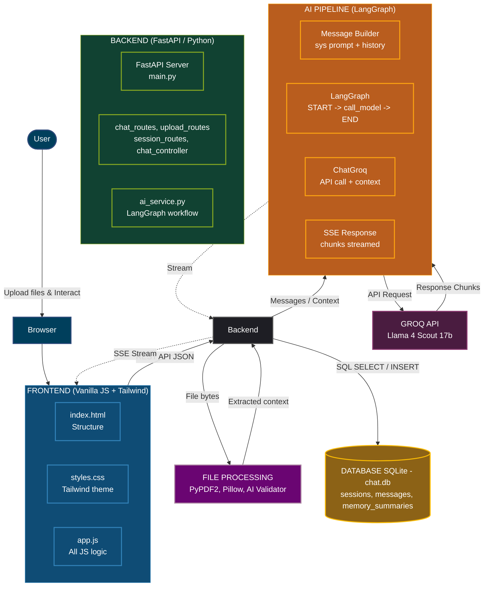

# ScanSense AI 🧿

Welcome to **ScanSense AI**! This is a specialized, AI-powered medical assistant. It helps users analyze medical reports (PDFs) and medical images (X-rays, MRIs, etc.) using the powerful Llama model via Groq, intelligently orchestrated by **LangChain** and **LangGraph**, serving JSON endpoints via a high-performance **FastAPI** backend, and displayed on a clean 

🌐 **Live Demo:** [Click here to try ScanSense AI live!](https://scansense-ai-x59u.onrender.com/)

---

This document will guide you step-by-step on how to run this project on your own computer, even if you are a complete beginner!

If you want to understand how every single file in the code works line-by-line, please read the [ARCHITECTURE.md](ARCHITECTURE.md) and [FULL_DOCUMENTATION.md](FULL_DOCUMENTATION.md) files!

---

## 🏗️ Architecture & Technology Stack

### Languages & Technologies Used
* **Python**: Core backend programming language.
* **JavaScript (Vanilla JS)**: Frontend logic and interactivity.
* **HTML5 & CSS3**: UI structure and styling (using Tailwind CSS for design).
* **FastAPI**: High-performance backend web framework.
* **SQLite**: Lightweight local database (`chat.db`) for storing user sessions, messages, and memory summaries.
* **LangGraph & LangChain**: AI workflow orchestration, message building, and agent routing.
* **Groq API**: Extremely fast LLM inference engine hosting the **Llama 4 Scout** model.
* **PyPDF2 & Pillow**: File processing libraries to extract text from medical PDFs and encode X-ray/MRI images.

### High-Level System Architecture



---

## 🚀 How to Run the App (Step-by-Step)

### Step 1: Install Python
You need to have Python installed on your computer. 
- **Python:** Go to [python.org](https://www.python.org/downloads/) and download the latest version for your operating system (Windows, Mac, or Linux).
- **Important for Windows users:** When installing Python, make sure to check the box that says **"Add Python to PATH"**.

*(Note: Because this project uses a build-free Vanilla JS architecture, you DO NOT need Node.js or `npm`!)*

### Step 2: Get a Free AI API Key
This app uses an AI brain from a company called Groq. You need a free key to connect to it.
1. Go to [Groq Console](https://console.groq.com/keys).
2. Create a free account.
3. Click on "Create API Key" and copy the long string of text. Keep it absolutely secret!

### Step 3: Set Up the Project Environment
1. Open up your terminal (or Command Prompt / PowerShell on Windows) and navigate to the folder where this project is saved.
2. Go into the `backend/` folder (`cd backend`).
3. Inside the `backend/` folder, create a new file named exactly `.env` (don't forget the dot at the beginning).
4. Open the `.env` file in notepad or any text editor and paste your API key exactly like this:
   ```env
   GROQ_API_KEY=your_copied_api_key_here
   ```
5. Save the file.

### Step 4: Simple One-Click Start (Automated Script)
Because this project uses a **Simplified Unified Architecture**, you only need to run one script! The FastAPI backend will automatically serve the Vanilla JS frontend files on the same port.

Go back to the main `ScanSense AI` folder in your terminal, and run:

**(Windows)**:
```cmd
.\run.bat
```

**(Mac / Linux)**:
```bash
./run.sh
```

**What the script does automatically:**
1. Triggers the creation of your Python virtual environment (`venv`).
2. Activates the virtual environment and installs all required Python backend dependencies.
3. Bypasses frontend building (Vanilla JS does not need compiling!).
4. **Starts the Unified Server** on Port 8000.

Your browser will NOT automatically open, you must manually go to **`http://127.0.0.1:8000`** in your web browser, where you can start chatting with your AI!

---

## ✨ Features
- **Build-Free Architecture:** A seamless, single-port architecture where FastAPI serves a high-performance logic engine and a clean Vanilla JS UI. No `npm install` or compilation needed!
- **Long-Term Memory:** The AI remembers your past conversations by automatically generating session summaries and storing them in a local SQLite database.
- **Strictly Medical Guardrails:** The AI validates every file you upload and uses late-binding prompt injection to absolutely refuse non-medical questions.
- **Image & PDF Support:** Upload your medical PDFs or X-rays directly into the chat for visual analysis.
- **Persistent Storage:** Every chat session and assistant memory is saved inside the local `chat.db` database.
- **Workflow Orchestration:** Advanced local routing built on **LangGraph**, providing smooth, real-time streaming capabilities.
- **Custom Markdown Rendering:** A lightweight, built-in Javascript markdown parser ensures beautiful formatting for headings, lists, and bold text without external library bloat.

